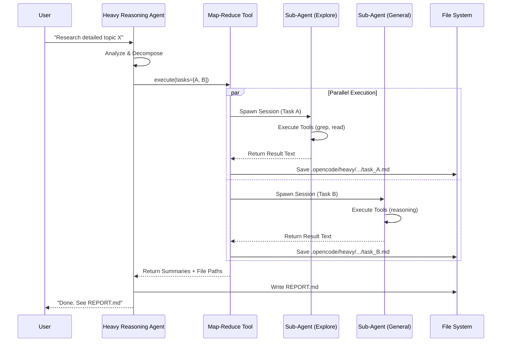
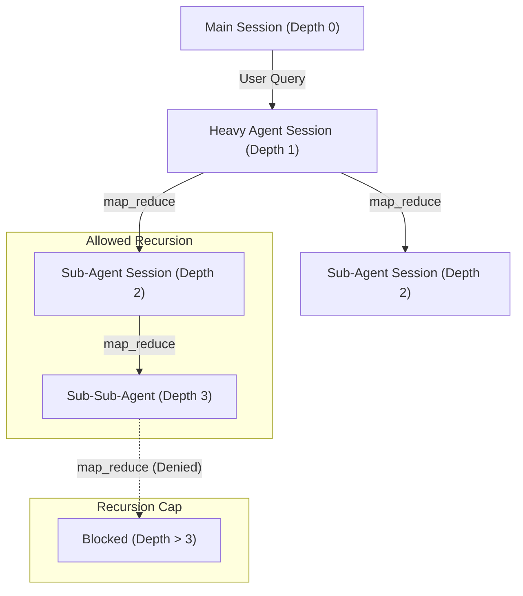
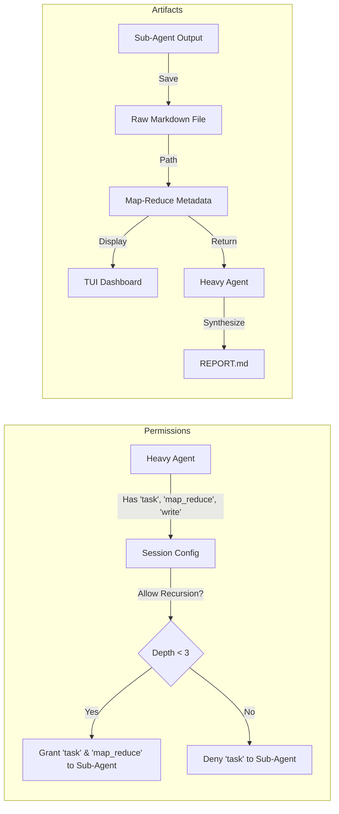
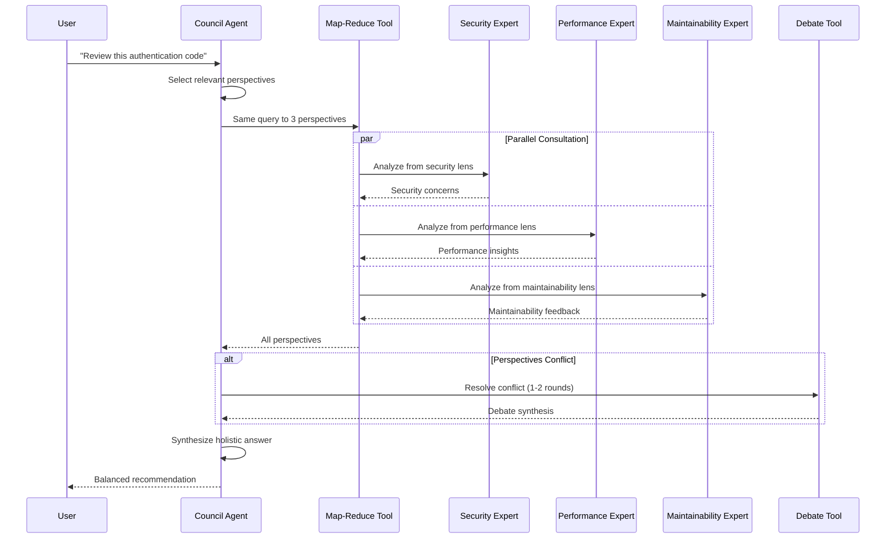
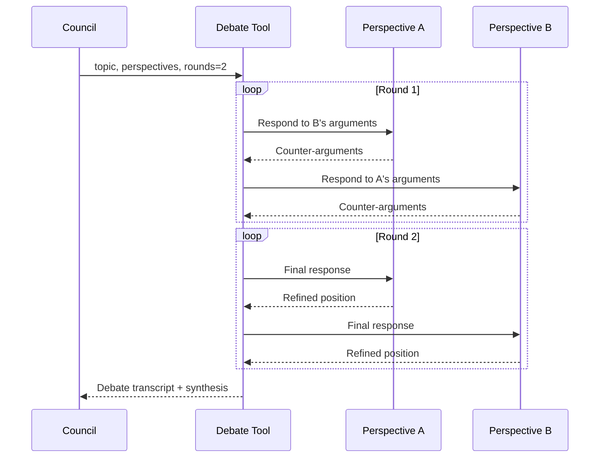
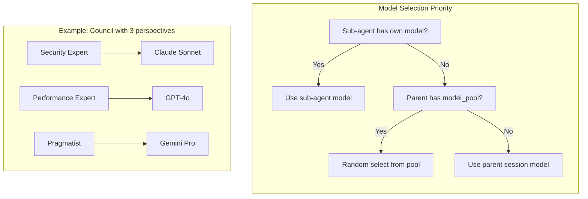

# Heavy Reasoning Agent Architecture

## 1. High-Level Workflow

This diagram illustrates how the Heavy Reasoning Agent handles a user query by decomposing it into parallel tasks.



## 2. Recursive Decomposition (Depth Control)

This diagram shows how the system manages recursion depth to prevent infinite loops while allowing deep research.



## 3. Permission & Artifact Flow

How permissions are inherited and where data is stored.



## 4. Usage & CLI

You can invoke the Heavy Reasoning Agent directly from the command line to start a deep research task.

### Command Line Invocation

```bash
opencode --agent heavy "Your complex query here"
```

### Execution Mode

When invoked, the agent operates in **Execution Mode**:

1.  **Decomposition**: It breaks down the query into distinct sub-tasks.
2.  **Parallel Execution**: It launches parallel sessions for each task. The dashboard will show real-time progress.
3.  **Recursive Research**: If a sub-task is complex, sub-agents can autonomously spawn their own sub-agents (up to 3 levels deep).
4.  **Artifact Generation**: All raw research notes are saved to `.opencode/heavy/[session_id]/`.
5.  **Final Report**: The agent synthesizes all findings into a `REPORT.md` file in your working directory.

---

# Council Agent Architecture

## Overview

The Council Agent uses a **perspective decomposition** pattern rather than task decomposition. Instead of splitting work into parts, it sends the SAME query to multiple agents with different expertise "lenses" and synthesizes their insights.

## 1. High-Level Workflow



## 2. When to Use Council vs Heavy

| Aspect            | Heavy Agent                    | Council Agent                                   |
| ----------------- | ------------------------------ | ----------------------------------------------- |
| **Decomposition** | By task (different work)       | By perspective (same work, different lenses)    |
| **Use Case**      | Research, multi-part questions | Code review, architecture decisions, trade-offs |
| **Output**        | Comprehensive report           | Balanced recommendation with trade-offs         |
| **Sub-agents**    | Explore + General              | General with different personas                 |

## 3. Perspective Types

### For Code Review / Implementation

- **Security Expert**: Vulnerabilities, auth, input validation, secrets
- **Performance Expert**: Efficiency, bottlenecks, memory, scalability
- **Maintainability Expert**: Readability, patterns, testing, documentation
- **Architecture Expert**: Design patterns, coupling, extensibility

### For Architecture / Design Decisions

- **Pragmatist**: Simplicity, shipping fast, avoiding over-engineering
- **Purist**: Best practices, clean architecture, long-term maintainability
- **User Advocate**: UX, developer experience, API ergonomics
- **Operations Expert**: Deployment, monitoring, reliability

### For Debugging / Investigation

- **Detective**: Methodical root cause analysis, evidence gathering
- **Systems Thinker**: Broader context, side effects, interconnections
- **Skeptic**: Question assumptions, consider edge cases, verify claims

## 4. The Debate Tool

When perspectives strongly conflict, the Council can invoke the `debate` tool to have them respond to each other's arguments.



### When to Debate

- Two or more perspectives reach opposite conclusions
- A perspective raises a critical concern that others dismiss
- The "right answer" depends on unstated priorities

### When NOT to Debate

- Perspectives simply cover different aspects (complementary, not conflicting)
- Disagreements are minor or about implementation details

## 5. Usage & CLI

### Command Line Invocation

```bash
opencode --agent council "Should I use Redis or PostgreSQL for my session store?"
```

### Execution Mode

1. **Perspective Selection**: Council chooses 2-4 relevant expert personas
2. **Parallel Consultation**: Same query sent to all perspectives via `map_reduce`
3. **Conflict Detection**: Council evaluates if perspectives conflict
4. **Optional Debate**: If conflicts exist, `debate` tool is invoked (1-2 rounds)
5. **Synthesis**: Council produces holistic answer acknowledging trade-offs
6. **Report**: Full analysis written to `COUNCIL_REPORT.md`

### Artifacts

- Perspective outputs: `.opencode/council/[session_id]/perspectives/`
- Debate transcripts: `.opencode/council/[session_id]/debate_*.md`
- Final report: `COUNCIL_REPORT.md` in working directory

---

# Model Pool Configuration

Both Heavy and Council agents support **model pooling** — the ability to randomly distribute sub-tasks across multiple models. This enables model diversity (different models have different strengths/biases) and cost optimization.

## How It Works



## Configuration

Add `model_pool` to any agent in your `opencode.json`:

```json
{
  "agent": {
    "council": {
      "model_pool": ["anthropic/claude-sonnet-4-20250514", "openai/gpt-4o", "google/gemini-2.5-pro"]
    },
    "heavy": {
      "model_pool": ["anthropic/claude-sonnet-4-20250514", "openai/o3"]
    }
  }
}
```

## Use Cases

### 1. Diverse Perspectives (Council)

Different models have different training data, biases, and reasoning patterns. Using multiple models for Council perspectives can surface insights that a single model might miss:

```json
{
  "agent": {
    "council": {
      "model_pool": [
        "anthropic/claude-sonnet-4-20250514",
        "openai/gpt-4o",
        "google/gemini-2.5-pro",
        "deepseek/deepseek-r1"
      ]
    }
  }
}
```

### 2. Cost Optimization (Heavy)

Mix expensive high-capability models with cheaper models. Weight the distribution by repeating entries:

```json
{
  "agent": {
    "heavy": {
      "model_pool": [
        "anthropic/claude-sonnet-4-20250514",
        "anthropic/claude-sonnet-4-20250514",
        "anthropic/claude-sonnet-4-20250514",
        "openai/o3"
      ]
    }
  }
}
```

This gives 75% chance of using Sonnet (cheaper) and 25% chance of using o3 (more capable but expensive).

### 3. Capability Matching

Use reasoning models for complex analysis, fast models for simple lookups:

```json
{
  "agent": {
    "heavy": {
      "model_pool": ["openai/o3", "anthropic/claude-sonnet-4-20250514", "openai/gpt-4o-mini"]
    }
  }
}
```

## Behavior Details

| Scenario                         | Model Used                           |
| -------------------------------- | ------------------------------------ |
| Sub-agent has `model` configured | Sub-agent's model (highest priority) |
| Parent agent has `model_pool`    | Random selection from pool           |
| Neither configured               | Parent session's current model       |

### Tools That Support Model Pool

- **`map_reduce`**: Each parallel task randomly selects from pool
- **`debate`**: Each perspective in each round randomly selects from pool

### Notes

- Selection is random per-task, not round-robin
- The same model may be selected multiple times by chance
- To guarantee a specific model for a sub-agent type, configure `model` on that agent instead
